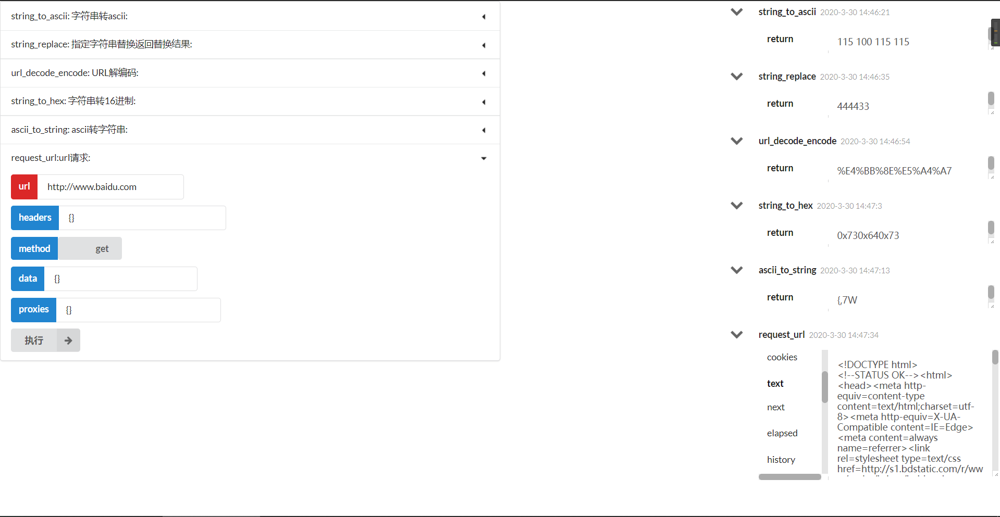

### Local Function Online
> 在前端输入参数, 传递给后端执行并返回结果
- 最开始只是学习渗透过程中字符串的转换, 需要各个网站来回切换着用, 打算做个小工具能够在一个网站上集合各种自己用的到的功能, 省时省力
- 这个项目还有待完善, 等有时间再继续完善吧(又给自己挖了个坑)
    - TODO
        1. 将函数写入数据库, 调用时生成tmp文件并执行
        2. 前端优化
        3. 函数规则说明文档
        4. 最终效果: 实现用户登录上传py函数, 共享实现指定功能的代码块, 并可以在线上执行
- 前端示例图:
    - 
- 后端:
    - 通过修改tools_functions.py 文件, 然后使用正则解析, 显示在前端
    - 例子: `utils/tools_functions.py`, string_replace函数

    ```python
    def string_replace(target_str, old_str, new_str=''):
        """
        description: 指定字符串替换返回替换结果
        :param target_str:
        :param old_str:
        :param new_str:
        :return:
        """

        return convert_single_data_to_json(target_str.replace(old_str, new_str))
    ```
